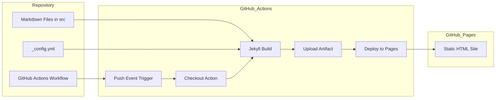
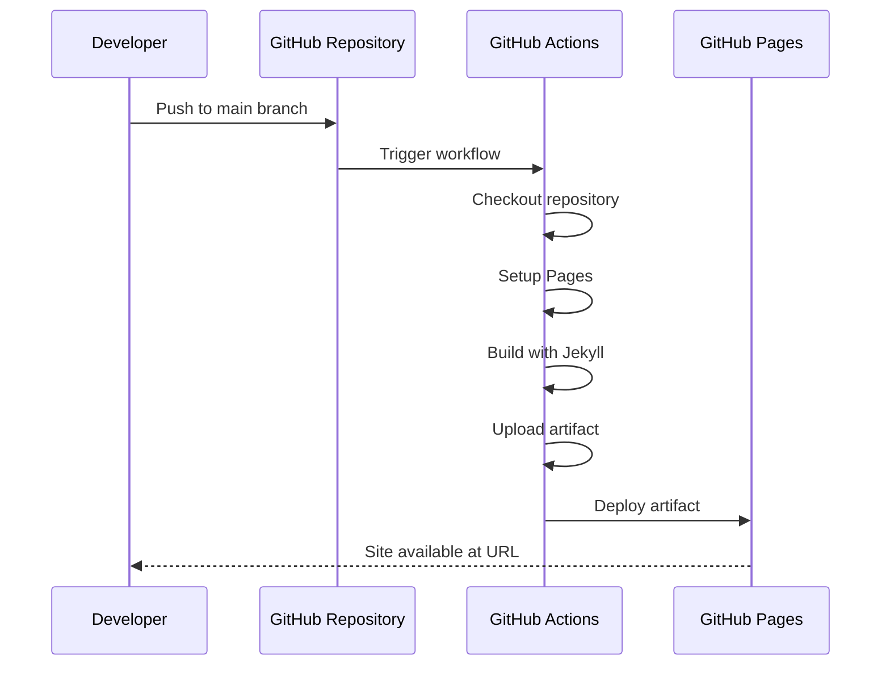

# Design Document

## Overview
**Purpose**: この機能は、SF6のメモをマークダウン形式で作成し、GitHub Pagesを通じてオンラインで閲覧可能な静的サイトとして公開する仕組みを提供する。

**Users**: 開発者（作者）がメモを作成・更新し、閲覧者がオンラインでメモを参照する。

**Impact**: リポジトリにGitHub Actionsワークフローと設定ファイルを追加し、自動デプロイパイプラインを構築する。

### Goals
- mainブランチへのプッシュ時に自動的にサイトをビルド・デプロイする
- src/配下のマークダウンファイルをHTMLに変換して公開する
- GitHub Pagesの公開URLでサイトにアクセス可能にする

### Non-Goals
- カスタムドメインの設定（デフォルトのgithub.io URLを使用）
- 複雑なテーマやレイアウトのカスタマイズ
- 検索機能やコメント機能などの動的機能

## Architecture

### Architecture Pattern & Boundary Map



**Architecture Integration**:
- **Selected pattern**: GitHub Actions + Jekyll自動ビルド（GitHub Pagesネイティブサポート）
- **Domain boundaries**: ソースファイル（src/）とビルド成果物（GitHub Pages）の分離
- **Existing patterns preserved**: プロジェクトのsrc/配下にマークダウンを配置するパターンを維持
- **New components rationale**: GitHub Actionsワークフロー（デプロイ自動化）、Jekyll設定（ソースディレクトリ指定）
- **Steering compliance**: tech.mdに定義されたGitHub Actions + GitHub Pagesアーキテクチャに準拠

### Technology Stack

| Layer | Choice / Version | Role in Feature | Notes |
|-------|------------------|-----------------|-------|
| Infrastructure / Runtime | GitHub Actions | CI/CDパイプライン実行 | 公式ワークフローを使用 |
| Infrastructure / Runtime | GitHub Pages | 静的サイトホスティング | Jekyll自動ビルドを使用 |
| Backend / Services | Jekyll (GitHub Pages built-in) | マークダウン→HTML変換 | kramdownプロセッサ使用 |

## System Flows

### デプロイフロー



**Key Decisions**:
- ワークフローはmainブランチへのプッシュでのみ実行される
- Jekyllビルドはsrc/ディレクトリをソースとして使用
- デプロイ後、GitHub PagesのURLでサイトが公開される

## Requirements Traceability

| Requirement | Summary | Components | Interfaces | Flows |
|-------------|---------|------------|------------|-------|
| 1.1 | mainブランチプッシュ時にビルド開始 | deploy.yml | on.push.branches | デプロイフロー |
| 1.2 | PRマージ時にビルド開始 | deploy.yml | on.push.branches | デプロイフロー |
| 1.3 | mainブランチ以外でビルドしない | deploy.yml | on.push.branches | - |
| 2.1 | マークダウンファイル検出 | _config.yml | source設定 | デプロイフロー |
| 2.2 | HTML変換 | Jekyll | kramdown | デプロイフロー |
| 2.3 | デプロイ用ディレクトリ出力 | Jekyll | _site | デプロイフロー |
| 2.4 | 空のサイト生成 | Jekyll | - | デプロイフロー |
| 3.1 | GitHub Pagesへデプロイ | deploy-pages action | - | デプロイフロー |
| 3.2 | 公開URLでアクセス可能 | GitHub Pages | URL | - |
| 3.3 | デプロイ失敗時エラーログ | GitHub Actions | logs | デプロイフロー |

## Components and Interfaces

| Component | Domain/Layer | Intent | Req Coverage | Key Dependencies | Contracts |
|-----------|--------------|--------|--------------|------------------|-----------|
| deploy.yml | CI/CD | ワークフロー定義とトリガー制御 | 1.1, 1.2, 1.3, 3.1, 3.3 | GitHub Actions (P0) | Workflow |
| _config.yml | Configuration | Jekyllビルド設定 | 2.1, 2.2, 2.3, 2.4 | Jekyll (P0) | Config |

### CI/CD Layer

#### deploy.yml

| Field | Detail |
|-------|--------|
| Intent | mainブランチへのプッシュ時にJekyllビルドとGitHub Pagesデプロイを実行 |
| Requirements | 1.1, 1.2, 1.3, 3.1, 3.3 |

**Responsibilities & Constraints**
- mainブランチへのプッシュイベントを検知してビルドをトリガー
- Jekyllでsrc/配下のマークダウンをHTMLに変換
- 生成された成果物をGitHub Pagesにデプロイ
- ビルド/デプロイ失敗時にエラーをログ出力

**Dependencies**
- External: `actions/checkout@v4` — リポジトリのチェックアウト (P0)
- External: `actions/configure-pages@v5` — GitHub Pages設定 (P0)
- External: `actions/jekyll-build-pages@v1` — Jekyllビルド (P0)
- External: `actions/upload-pages-artifact@v3` — 成果物アップロード (P0)
- External: `actions/deploy-pages@v4` — GitHub Pagesデプロイ (P0)

**Contracts**: Workflow [x]

##### Workflow Contract

```yaml
name: Deploy to GitHub Pages

on:
  push:
    branches:
      - main

permissions:
  contents: read
  pages: write
  id-token: write

concurrency:
  group: pages
  cancel-in-progress: false

jobs:
  build:
    runs-on: ubuntu-latest
    steps:
      - name: Checkout
        uses: actions/checkout@v4
      - name: Setup Pages
        uses: actions/configure-pages@v5
      - name: Build with Jekyll
        uses: actions/jekyll-build-pages@v1
        with:
          source: ./src
          destination: ./_site
      - name: Upload artifact
        uses: actions/upload-pages-artifact@v3

  deploy:
    environment:
      name: github-pages
      url: ${{ steps.deployment.outputs.page_url }}
    runs-on: ubuntu-latest
    needs: build
    steps:
      - name: Deploy to GitHub Pages
        id: deployment
        uses: actions/deploy-pages@v4
```

- Preconditions: mainブランチへのプッシュが発生
- Postconditions: GitHub Pagesにサイトがデプロイされる
- Invariants: mainブランチ以外のプッシュではワークフローは実行されない

**Implementation Notes**
- Integration: リポジトリ設定でGitHub PagesのSourceを「GitHub Actions」に設定する必要あり
- Validation: ワークフロー実行後、GitHub ActionsのUIでステータスを確認
- Risks: パーミッション設定が不正確な場合、デプロイが失敗する可能性

### Configuration Layer

#### _config.yml

| Field | Detail |
|-------|--------|
| Intent | Jekyllのソースディレクトリと基本設定を定義 |
| Requirements | 2.1, 2.2, 2.3, 2.4 |

**Responsibilities & Constraints**
- src/ディレクトリをJekyllのソースとして指定
- マークダウンファイルのHTML変換設定
- 基本的なサイトメタデータの定義

**Dependencies**
- External: Jekyll (GitHub Pages built-in) — マークダウン処理 (P0)

**Contracts**: Config [x]

##### Config Contract

```yaml
# Site settings
title: SF6 Notes
description: ストリートファイター6のメモ

# Build settings
source: src
markdown: kramdown

# Exclude files from build
exclude:
  - .kiro
  - README.md
  - LICENSE
```

- Preconditions: なし
- Postconditions: Jekyllがsrc/配下のマークダウンを処理対象とする
- Invariants: sourceディレクトリが存在しない場合でもビルドは成功する（空のサイト生成）

**Implementation Notes**
- Integration: プロジェクトルートに配置
- Validation: Jekyll設定の妥当性はビルド時に検証される
- Risks: YAML構文エラーがあるとビルドが失敗する

## Error Handling

### Error Strategy
GitHub Actionsのネイティブエラーハンドリングを活用し、各ステップの失敗をログに記録する。

### Error Categories and Responses

**System Errors**:
- ビルド失敗 → GitHub Actions UIにエラーログ表示、ジョブステータスが「Failed」になる
- デプロイ失敗 → パーミッションエラーまたはページ設定エラーをログに出力

**Business Logic Errors**:
- マークダウン構文エラー → Jekyllがワーニングをログに出力、可能な限りビルド続行

### Monitoring
- GitHub Actions UIでワークフロー実行状況を確認
- 失敗時はメール通知（GitHubのデフォルト設定）

## Testing Strategy

### Integration Tests
- mainブランチへのプッシュ後、ワークフローが正常に開始されることを確認
- ビルドジョブが完了し、デプロイジョブに進むことを確認
- GitHub PagesのURLでサイトにアクセスできることを確認

### E2E Tests
- マークダウンファイルを追加してプッシュし、HTMLとして公開されることを確認
- 空のsrc/ディレクトリでもビルドが成功することを確認
- mainブランチ以外へのプッシュでワークフローが実行されないことを確認
